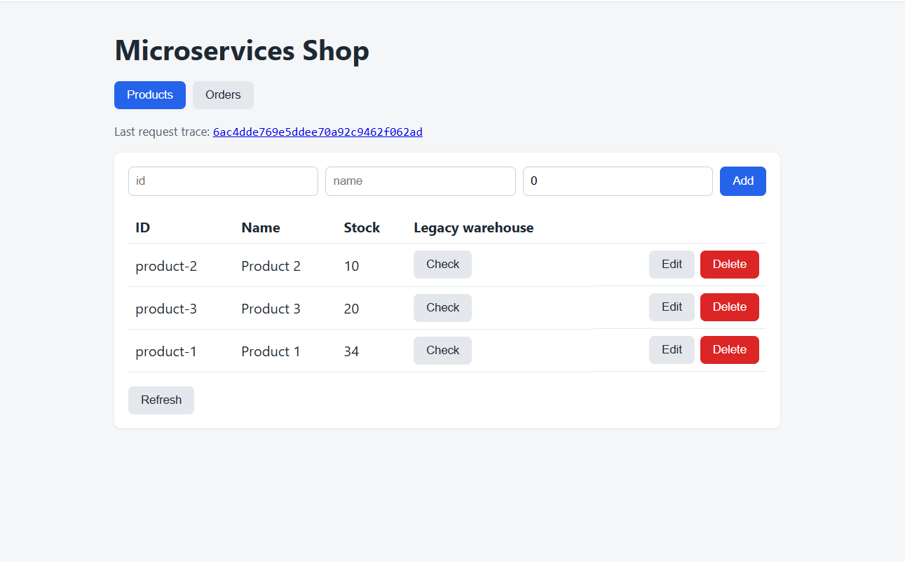
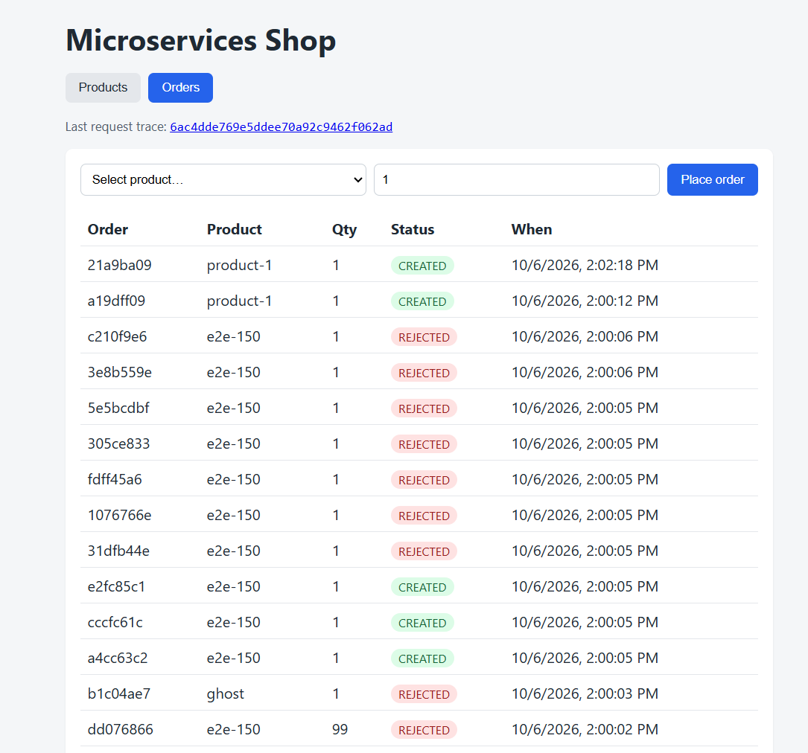
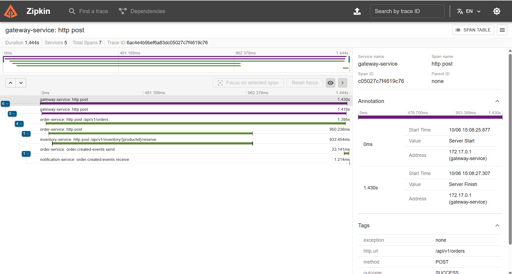
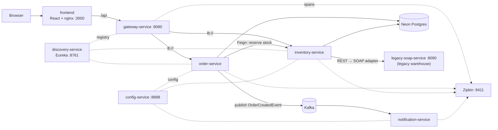

# microservices-ecommerce-demo

[](https://github.com/SenMusstafa/microservices-ecommerce-demo/actions/workflows/ci.yml)

<p align="center">
  
  
</p>
<p align="center">
  
</p>
<p align="center"><sub>The React UI (products with the legacy warehouse check, orders) and the Zipkin trace of a
single order, opened from the UI's “view this order's trace” link: gateway → order-service →
inventory-service, then order-service → Kafka → notification-service (5 services, 7 spans).</sub></p>


Spring Boot microservices (Eureka, Config Server, API Gateway, Inventory, Order, Notification over Kafka)
with a React frontend. Everything runs in Docker locally; **only the PostgreSQL database is hosted
externally** (free Neon tier), so you don't need a local DB.



## Run it

Requirements: Docker with Compose v2 (about 3 GB free RAM).

1. **Create a free database** at <https://neon.tech> (no card needed). In the project's **Connect**
   dialog copy the host, database, user and password.
2. **Configure credentials**:
   ```bash
   cp .env.example .env
   # edit .env: DB_URL=jdbc:postgresql://<host>/<database>?sslmode=require, DB_USER, DB_PASSWORD
   ```
   Use the plain host (no `channel_binding` parameter — the JDBC driver doesn't support it).
   `.env` is git-ignored; never commit it.
3. **Start everything**:
   ```bash
   docker compose up --build
   ```
   **In GitHub Codespaces** (or anywhere container-to-container networking is restricted) use the
   host-networking variant instead:
   ```bash
   docker compose -f docker-compose.yml -f docker-compose.host.yml up --build
   ```
   In Codespaces, open the forwarded port 3000 from the **Ports** tab.
   The first build takes a few minutes. Tables are created automatically and three demo
   products are seeded on first start.
4. **Open** <http://localhost:3000> (app), <http://localhost:8761> (Eureka dashboard) and
   <http://localhost:9411> (Zipkin traces).

Stop with `docker compose down`. Data stays in Neon, so it survives restarts.

### Using the pre-built images (no local build)

CI publishes every image to GitHub Container Registry. Once the packages are public you can skip the
Maven/npm builds entirely:

```bash
docker compose pull
docker compose up --no-build          # add -f docker-compose.host.yml in Codespaces
```
(Packages are private by default: GitHub → profile → Packages → each package → *Package settings* →
*Change visibility* → Public. Otherwise `docker login ghcr.io` first.)

## Things to try (and break)

- Add / edit / delete products in the UI; check them in the Neon console's Tables view.
- Order `product-3` (stock 0) or more than the stock → `REJECTED`. Order a normal amount → `CREATED`,
  and `docker compose logs -f notification-service` shows the Kafka event arriving.
- Create a product with an existing id → 409; negative quantity → 400; unknown id → 404.
- `docker compose stop inventory-service`, then use the UI: the gateway returns an error the UI shows.
  `docker compose start inventory-service` and it recovers once it re-registers in Eureka.
- `docker compose stop kafka`, place an order and read the order-service logs.
- `docker compose stop legacy-soap-service`, click **Check** → `503`; the Zipkin trace shows the failed call.
- Neon's free tier suspends an idle database; the first request after a pause can take a few seconds.

Useful: `docker compose ps`, `docker compose logs -f <service>`, `docker compose up -d --build <service>`.

## Legacy SOAP system and the adapter

`legacy-soap-service` simulates an old warehouse system that only speaks SOAP/XML
(`POST http://localhost:8090/ws`, WSDL at `http://localhost:8090/ws?wsdl`, operation `GetStockLevel`).
`inventory-service` hides it behind an **adapter** (`SoapWarehouseAdapter` implements `WarehouseGateway`):
REST clients just call `GET /api/v1/inventory/products/{id}/warehouse` and get JSON back; the SOAP
envelope building/parsing and fault handling stay inside the adapter. In the UI use the **Check**
button in the *Legacy warehouse* column. Unknown SKU → SOAP Fault → `404`; legacy system down → `503`.

```bash
curl -s -X POST localhost:8090/ws -H 'Content-Type: text/xml' -d '<e:Envelope xmlns:e="http://schemas.xmlsoap.org/soap/envelope/" xmlns:wh="http://legacy.example.com/warehouse"><e:Body><wh:GetStockLevelRequest><wh:sku>product-1</wh:sku></wh:GetStockLevelRequest></e:Body></e:Envelope>'
```

## Tracing (Zipkin)

Open <http://localhost:9411>, click **Run query**, pick a trace. One order shows the whole path:
`gateway → order-service → inventory-service`, then `order-service → Kafka → notification-service`.
Every log line carries `[service,traceId,spanId]`, so you can grep a request across services:
`docker compose logs | grep <traceId>`. The UI shows the trace id of the last request as a link
straight to its Zipkin trace (services return it in an `X-Trace-Id` header). Failed requests show up red, which makes the
"stop a service and see what breaks" experiments easy to read.

## Development without Docker

```bash
mvn test                      # all unit + Testcontainers tests (needs Docker for the Kafka ones)
cd frontend && npm install && npm run dev   # http://localhost:3000, proxies /api to localhost:8080
```
Without `DB_URL` the services fall back to an in-memory H2 database.

## Troubleshooting

- `required variable DB_URL is missing` → you skipped step 2.
- `UnknownHostException` for the Neon host, or `Connect timed out` between containers → the Docker
  bridge network is restricted (Codespaces). Use the `docker-compose.host.yml` variant above.
- Stopping a service (e.g. `inventory-service`) makes the gateway or order-service answer `503`; that's expected.

## CI/CD

`.github/workflows/ci.yml` runs on every push/PR: all Maven tests (including the Testcontainers Kafka
ones), the frontend build, and a Docker build of all 8 images. On pushes to `main` the images are also
published to GitHub Container Registry as `ghcr.io/<owner>/<service>:latest` and `:<commit-sha>`
(uses the built-in `GITHUB_TOKEN`; no secrets to configure).

## License

[MIT](LICENSE)
